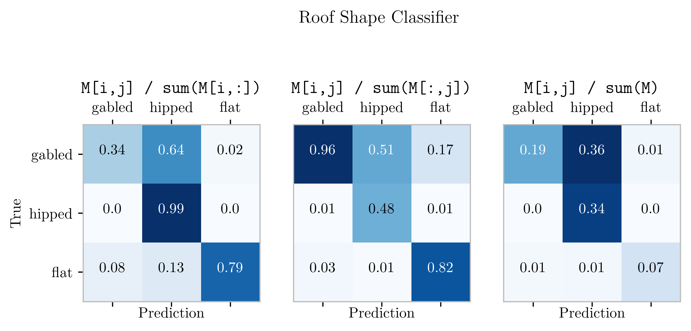
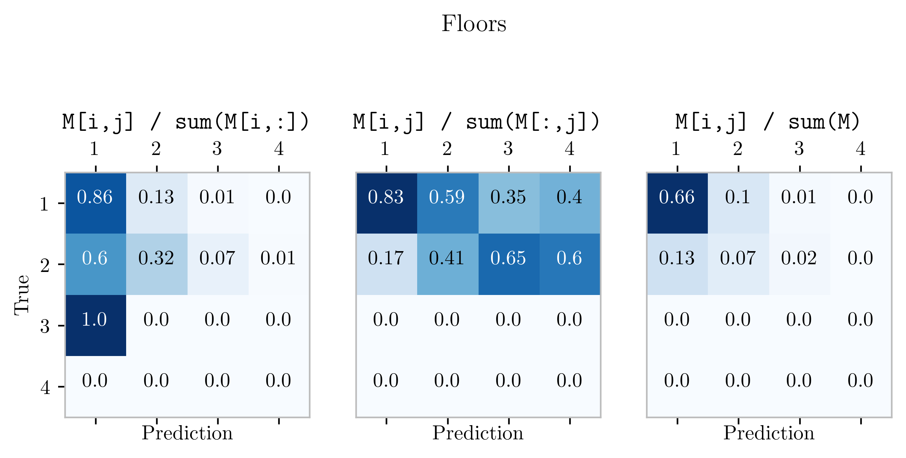
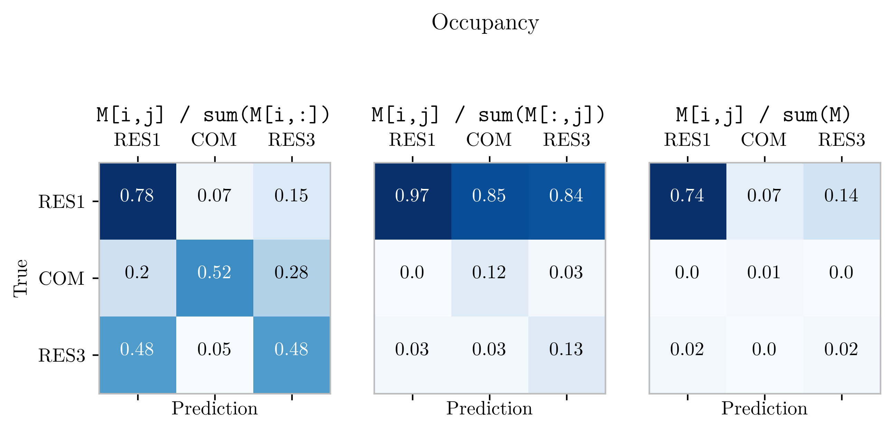
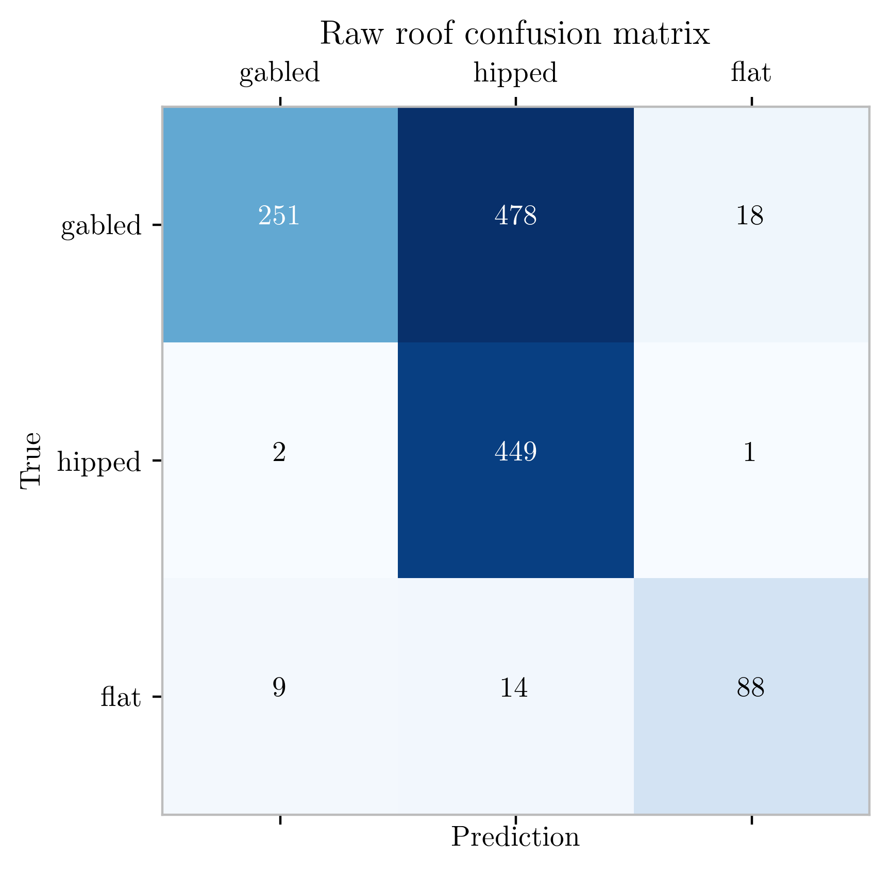
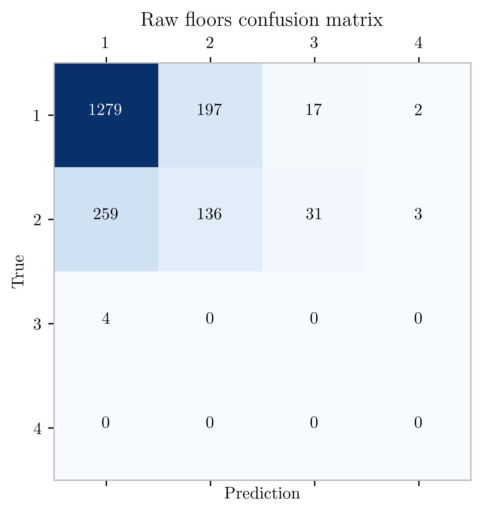
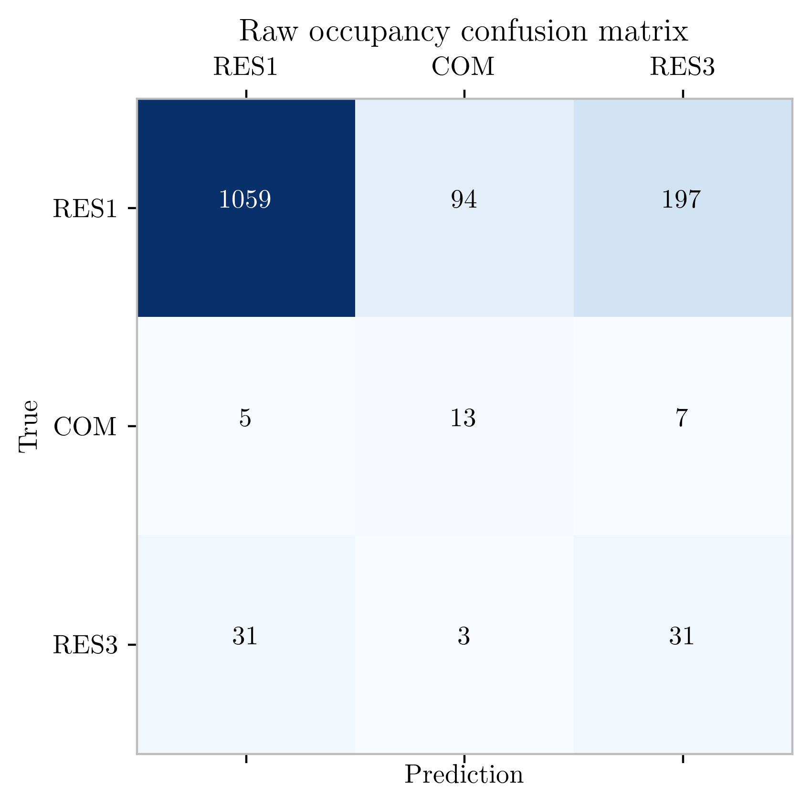

---
title: Miami FL dataset
...

---------------
<!--
# Summary

Results of the study are summarized in the following points:

- **Prediction**: When blindly applied to images obtained
  from Google, the models generally failed to reliably
  make predictions, largely due to the massive variability
  of inputs.

- **Confidence**: When blindly applied to images obtained
  from Google, the models generally failed to indicate
  low confidence in wrong predictions.

- **Workflow**: Features of BRAILS such as the `CityBuilder`
  are extremely helpful, but the package as a whole is not
  yet an "end-to-end" solution.

The primary conclusion of this study is that, currently,
there may not yet exist sources of images which would
make the use of these models feasible for blind
city-wide predictions. However, these models may still
prove very useful if it is possible to provide either
(1) tooling filtering out unfit images, or (2) robust
confidence/probability scores for model outputs.

The image collections for the occupancy and floor models
where not nearly as refined as that of the roof study. The
poor performance of these models is largely due to the poor
suitability of these images for the task. These models may
be very powerful, but their true utility may ultimately be
limited by the absence of image data which is fit for such
tasks.

Roof shape prediction appears to be the most tractable
problem targeted by the BRAILS package for a few reasons:

- Top-view images that can be readily obtained through
  Google appear better suited for image recognition
  applications than similarly obtained street-view images.
- The information produced by the occupancy and floor models
  can typically be obtained through simpler and far more
  robust means.

However, the occupancy and floor models can still be
extremely useful in alternative applications. For example,
by checking the output of these models against scraped data,
they can be used to obtain a confidence metric of other
models for which results cannot be scraped, such as a
first-floor elevation model.

-->

\pagebreak

# Model Summaries

>NOTE: These results are not from a *balanced* sample set.
In all studies, there was one category which greatly
outnumbered the others.

## Roof Classifier

- The model correctly identified about $30$ % of the gabled roofs
  in the dataset. Of the $262$ *predicted* gabled roofs, $94$ % of
  these were truly gabled.

- If the model says a roof is gabled, it is probably right.
  However, for any gabled structure in particular, its chances of
  being correctly identified as such are not great.

- If the model says a roof is hipped, there is a very strong chance
  that it is really something else. However, because most roofs
  will be classified as hipped, all true hips are likely to be
  identified as such.

## Number of Floors

- The floor predictor model correctly identified about $90$ % of
  the 1-story structures.

- Only $34$ % of 2-story structures were correctly identified as
  such, and the model was only right $40$ % of the time when it
  predicted 2-stories.

## Occupancy

- The results of the occupancy study are inconclusive due to 
  lack of variation of inputs, with $93$ % of images gathered
  by the city builder falling under `RES1`. 

- If the model predicted `RES1`, $97$ % of the time if was right.
  Furthermore, $78$ % of the `RES1` images were correctly
  identified as `RES1` and only $7$ % were incorrectly identified
  as commercial (`COM`). The remaining $15$ % of the true `RES1`
  properties were identified as `RES3`, however, this is a
  distinction which often cannot be made visually.

- Of the roughly $2000$ properties gathered by the city builder, 
  and scraped, there were less than $100$ samples for each `RES3`
  and `COM`.

\pagebreak

# Statistics


## Roofs

|             | Precision |  Recall |F1-score | Support
|-------------|-----------|---------|---------|--------- 
|    `  flat` |     0.82  |   0.79  |   0.81  |    111
|    `gabled` |     0.96  |   0.34  |   0.50  |    747
|    `hipped` |     0.48  |   0.99  |   0.64  |    452
|    Accuracy |           |         |   0.60  |   1310
|   Macro avg |     0.75  |   0.71  |   0.65  |   1310
|Weighted avg |     0.78  |   0.60  |   0.57  |   1310


## Floors


|             |Precision |  Recall |F1-score | Support |
|-------------|----------|---------|---------|---------|
|         0   |      -   |     -   |     -   |      29 |
|         1   |     0.82 |    0.86 |    0.84 |    1495
|         2   |     0.40 |    0.32 |    0.36 |     429
|         3   |      -   |     -   |     -   |       4
|         4   |      -   |     -   |     -   |       0
|        15   |      -   |     -   |     -   |       1
|    Accuracy |          |         |    0.72 |    1958
|   Macro avg |     0.20 |    0.20 |    0.20 |    1958
|Weighted avg |     0.71 |    0.72 |    0.72 |    1958

## Occupancy

|             | Precision|  Recall |F1-score | Support |
|-------------|----------|---------|---------|---------|
|      ` COM` |     0.12 |    0.52 |    0.19 |      25
|      `RES1` |     0.97 |    0.78 |    0.87 |    1350
|      `RES3` |     0.13 |    0.48 |    0.21 |      65
|    Accuracy |          |         |    0.77 |    1440
|   Macro avg |     0.41 |    0.59 |    0.42 |    1440
|Weighted avg |     0.91 |    0.77 |    0.82 |    1440


\pagebreak

# Confusion Matrices
<!--
For the sample set analyzed, elements $M_{ij}$ of the 
confusion matrices may be interpreted as follows:

- **Left** Probability that sample is predicted as a $j$,
  given it is really an $i$.
- **Center** Probability that a sample is an $i$ given a
  prediction of $j$.
- **Right** Probability that a building in the data set
  is an $i$ and predicted as $j$.
-->







<!--


-->

# Details

The roof model used for prediction was `rooftype_ResNet50_V0.2`.

## City Builder / Data

The `brails.CityBuilder` class was used to obtain a collection of images from the following areas in Miami-Dade county:


| Place        | No. Images|
|--------------|-----------|
| Homestead    |   200     | 
| Cutler-bay   |   2177    |
| Coral Gables |   504     |
| Palmetto Bay |   200     | 
| Kendall      |   1000    |
| **Total**    | **4081**  |

Of the roughly 4000 top view images collected with `brails.CityBuilder`,
all were reviewed, 2331 were manually classified, and of these **1310** 
were selected for use in the roof validation study.


| Label         | No. Images |
|---------------|:--------:|
| gabled        |   747    | 
| hipped        |   452    |
| flat          |   111    |
| **total**     | **1310** |


Of the roughly $4000$ street view images which were retrieved by the
`CityBuilder`, the coordinates of $2283$ were successfully linked
to an address through Google and scraped from the
[Miami-Dade Property Search](https://www.miamidade.gov/Apps/PA/propertysearch/)
web application. These were then manually combed to remove
severely obstructed images from the data set resulting in about $1900$
images against which the `brails.modules.NFloorDetector` and 
`brails.modules.OccupancyClassifier` models are tested. 

\pagebreak


\pagebreak

<!--

# To Do

Validation

- Study whether model confidence/probability correlates with obstructed images.

Models/ Features

- Identify/filter out 
-->

# Appendix

## Unnormalized confusion matrices

<figure>
 
 
 
 <figcaption>Three images labed as `RES1` from the input data set randomly selected.</figcaption>
</figure>

{width="30%"}
{width="30%"}
{width="30%"}

\pagebreak 

## Miami-Dade Occupancy Classifications

Mappings from scraped occupancy classifications to labels used by BRAILS.

```json
{
    "RES1": [
        "IMPR AGRI : RESIDENTIAL - SINGLE FAMILY",
        "RESIDENTIAL - SINGLE FAMILY : 1 UNIT",
        "RESIDENTIAL - SINGLE FAMILY : ADDITIONAL LIVING QUARTERS",
        "RESIDENTIAL - SINGLE FAMILY : CLUSTER HOME",
        "RESIDENTIAL - SINGLE FAMILY : RESIDENTIAL - TOTAL VALUE",
        "VACANT RESIDENTIAL : EXTRA FEA OTHER THAN PARKING",
        "VACANT RESIDENTIAL : VACANT LAND",
    ],
    "RES3": [
        "MULTIFAMILY 2-9 UNITS : 2 LIVING UNITS",
        
        "MULTIFAMILY 10 UNITS PLUS : MULTIFAMILY 3 OR MORE UNITS",
        "MULTIFAMILY 2-9 UNITS : MULTIFAMILY 3 OR MORE UNITS",
        "RESIDENTIAL - TOTAL VALUE : CONDOMINIUM - RESIDENTIAL",
        "RESIDENTIAL - TOTAL VALUE : TOWNHOUSE",
    ],
    "COM": [
        "BOARD OF PUBLIC INSTRUCTION : BOARD OF PUBLIC INSTRUCTION",
        "HOTEL OR MOTEL : MOTEL",
        "RELIGIOUS - EXEMPT : RELIGIOUS",
        "RESTAURANT OR CAFETERIA : RETAIL OUTLET",
        "SERVICE STATION : RETAIL OUTLET",
        "SERVICE STATION : SERVICE STATION - AUTOMOTIVE",
        "STORE : RETAIL OUTLET",
        "TOURIST ATTRACTION/EXHIBIT : ENTERTAINMENT",
        "UTILITY : UTILITY",
        "MUNICIPAL : MUNICIPAL",
        "OFFICE BUILDING - MULTISTORY : OFFICE BUILDING",
        "OFFICE BUILDING - ONE STORY : OFFICE BUILDING",
        "PARKING LOT/MOBILE HOME PARK : PARKING LOT",
        "PROFESSIONAL SERVICE BLDG : OFFICE BUILDING",
        "REFERENCE FOLIO",
        "REPAIR SHOP/NON AUTOMOTIVE : REPAIRS - NON AUTOMOTIVE",

        "AUTOMOTIVE OR MARINE : AUTOMOTIVE OR MARINE",
        "COUNTY : DADE COUNTY",
        "EDUCATIONAL/SCIENTIFIC - EX : EDUCATIONAL - PRIVATE",
        "ENCLOSED RECEATIONAL ARENA : ENTERTAINMENT",
        "FINANCIAL INSTITUTION : OFFICE BUILDING",
        "HOME FOR THE AGED : HEALTH CARE",
    ]
}
```
 
